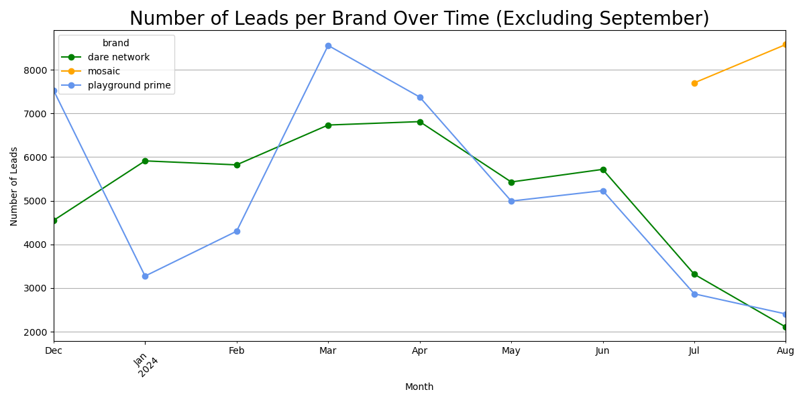

# Exploratory Analysis for Saasquatch Videos

##### This project was completed as part of a technical assignment at a recent job interview. 
##### In this project, I conduct a preliminary exploration of a fictitious online video streaming service KPIs. This preliminary analysis will then serve as a foundation for future business questions, which I will be exploring and answering in future projects.
##### This ReadMe outlines the steps to my analytical process in my preliminary exploration and first chosen business question. 

# Project Overview

### Premise
##### You're an analyst for "SaaSquatch Videos": a B2C subscription based video streaming service
##### Conduct an exploratory analysis of the data and present insights to a chosen business question

### About "SaaSquatch Videos"
##### 1. Saasquatch Videos Hosts Three Brands:
###### Dare Network: For Adults
###### Playground Prime: For Children
###### Mosaic: For General Audiences
##### 2. Mosaic is a recently launched brand
##### 3. Dare Network has been outperforming Playground Prime in various metrics, most notably in:
###### Trial to Subscription Rates
###### User Engagement

### Chosen Business Questions

##### 1. Why has Dare Network been outperforming Playground Prime in various KPIs?
##### 2. Can Dare's success be replicated in the other two brands?
##### 3. What strategies can SaaSquatch Videos' teams use to drive up numbers in the other brands?
##### In the "Initial Exploration" section, I will explain how and why I chose these three business questions

### Datasets
##### The dataset consists of four tables: Leads, Trials, Cancellations and Watched Videos
##### Table 1: Leads
###### Records of people signing up for email campaigns, called "Leads"
###### Leads offer free teaser material to entice potential customers to sign up for a free trial subscription period
##### Table 2: Trials
###### Records of trial periods
###### A trial period is mandatory before a user can subscribe
##### Table 3: Cancellations
###### Records of users canceling their subscriptions
##### Table 4: Watched Videos
###### Daily summary of watched videos by user
###### Includes details such as: video genre, which brand the video is from, etc.

### Steps to Analysis
##### Step 1. Initial Exploration
###### Explore each individual table and record initial insghts
###### From the initial insights, note potential areas and business questions to explore
##### Step 2. Choose a Single Area of Focus (Dare's Success Factors)
###### Conduct Statistical Analyses
###### Create Visualizations for a Presentation
##### Step 3. Final Recommendations and Insights
###### Compile insights into a presentation
##### Step 4. Suggest Additional Areas to Research and Questions to Answer

# Step 1. Initial Exploration and Choosing a Business Question
##### In this step, I explored each of the four tables individually. By creating visualizations and noting preliminary insights, I noted possible business questions to focus on.

## Initial Exploration

### Table 1: Leads

##### 1. "Dare Network" and "Playground Prime" have similar a number of leads. They both have far more leads than "Mosaic".

##### 1. "Mosaic" is likely a new brand, as they had no leads until July 2024. This likely explains why they had far fewer leads than the other two brands
##### 2. "Dare Network" and "Playground Prime" have had declining leads from March/April through July/August. 
##### 3. "Playground Prime" shows the most extreme fluctuations - maybe caused by seasonality.

##### 1. The number of total leads fluctuates much less than individual brands (particularly the two leading brands)
##### 2. July/August showed a healthy number of leads, despite the two leading networks ("Dare Network" and "Playground Prime") having very low numbers in those months

##### 1. Each brand had one Lead campaign that was vastly more successful/popular than all of their other campaigns
##### 2. "Playground Prime" had the most popular campaign of all, "Cuddle Up for Cartoon Time" 
###### It would be useful later to check if this campaign launched during one of "Playground Prime's" peak months of December or March (See corresponding graph above)

### Table 2: Trials

##### 1. "Dare Network" has by far the most number of trials. This is interesting because "Playground Prime" has a far lower number of trials despite having a similar number of leads. This requires further research. Possible reasons/explanations include:
###### Do more "Dare Network" Leads convert into Trials?
###### Does "Dare Network" attract more people to sign up for trials without a lead campaign?

### Table 3: Cancellations
###### I did not use this table for my chosen topic, but the initial insights from this table warrant further research

##### 1. There was a steep, steady rise of cancellations between December-February and June-August. Look into possible reasons.

### Table 4: Watched Videos

##### 1. "Dare Network" shows highest levels of user engagement by far by number of videos watched

##### 1. "Comedy" and "Reality" are by far the most popular genres by number of videos watched. Possible reasons to look into include:
###### Are users binging these videos in one sitting? 
###### Are more users watching these overall?

##### 1. There is a recent decline in user engagement (video watch time) between July-August

## Choosing business questions to answer

#### From the initial exploration and my recorded preliminary insights, there were multiple interesting possible questions to explore. I chose three business questions to guide my exploration. Other questions may be explored in future projects.

##### 1. Why has Dare Network been outperforming Playground Prime in various KPIs?
##### 2. Can Dare's success be replicated in the other two brands?
##### 3. What strategies can SaaSquatch Videos' teams use to drive up numbers in the other brands?

# Step 2. Answering the Business Questions: Exploring Dare Network's Success Factors

### To answer these business questions, I used a variety of analytical techniques including: statistical analyses; merging tables; creating additional visualizations; creating a presentation; suggesting follow-up questions and next steps for further research.
